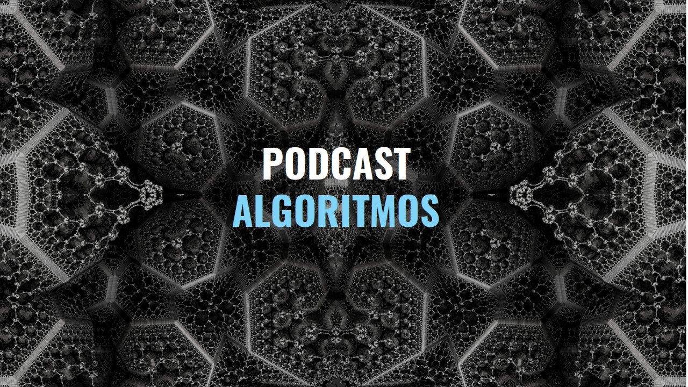

# PODCAST ALGORITMOS

Cree este podcast para discutir sobre el funcionamiento del software, con la intención de hacer difusión y despertar el interés sobre distintos temas que se relacionan con la tecnología y las ciencias de la computación. Estas son las notas del programa donde dejaré los enlaces, información extra y correciones que se hagan a los episodios.

En el *Podcast Algoritmos* hablaremos sobre problemas actuales y cómo resolverlos a través de la tecnología. Si utilizas algún servicio digital como las redes sociales y quieres saber cómo funcionan los algoritmos que analizan nuestros datos, nos hacen recomendaciones y toman decisiones automáticas por nosotros: escucha este podcast, ya que te dará una opinión informada sobre el funcionamiento, los riesgos y las ventajas que pueden derivar del uso de dichos servicios y sus algoritmos.

* Escuchar podcast en: https://ona309.com/Podcast

## Quiero saber más, hacer una corrección o una recomendación.

### Preguntas

Contactarme por las redes sociales usando el hashtag [#PodcastAlgoritmos](https://twitter.com/intent/tweet?url=http://anchor.fm/algoritmos;text=PodcastAlgoritmos%20via%20@Mariano_OG). Estaré en constante revisión de dichos comentarios.

### Correcciónes

Para realizar correcciónes lo mejor sería enviar un pull request por este medio o contactarme por redes sociales.

### Curso de programación

Es un proyecto que se está realizando en colaboración con el equipo de [Fundación Kichihua A.C.](www.kichihua.com). El curso será totalmente gratuito y en español. Su objetivo principal no es enseñar los conceptos de programación directamente sino que por medio de proyectos se busca enseñar habilidades como búsqueda de información y aprendizaje constante.

## Coolaboraciones

Si eres programador, científico o trabajas en alguna industria que incorpora tecnologías digitalesy te interesa inspirar a otros a conocer y utilizar estas herramientas. Se parte de un episodio del podcast y comparte tus ideas.

Colaboraciones actuales:
* Robando Ideas con [Eduardo Ayala](https://ona309.com/011).
* Computer Science/Software Engineering College Courses Review con [Andres Arriaga](https://ona309.com/012).

## Contacto

* [Anchor](https://ona309.com/Podcast).
* [Twitter](https://twitter.com/Mariano_OG).
* [Instagram](https://instagam.com/mariano_og).
* [LinkedIn](https://www.linkedin.com/in/marianoog/).
* **Correo**: contacto@marianoog.com.
* [Pagina Web](https://ona309.com/MarianoOG).
