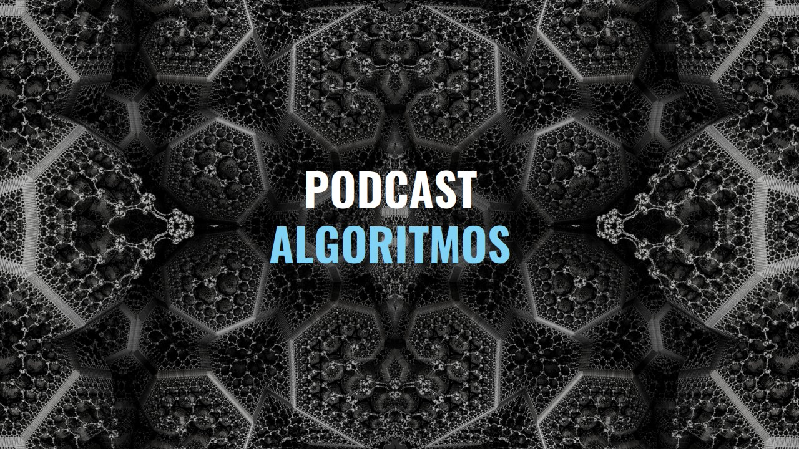

# PODCAST ALGORITMOS

Cree el Podcast Algoritmos para tener pláticas interesantes y aprender más sobre los temas que me gustan. Como cualquier persona cometo errores y no puedo abarcarlo todo en un simple episodio. Aquí encontrarás las notas del programa donde dejaré los enlaces que se mencionan en cada episodio, información extra y las correciones que se hagan.

## Escuchar el podcast

Puedes escuchar el podcast [aquí](https://ona309.com/Podcast).

## Leer notas

Este repositorio utiliza una platilla de jekill por lo que puede ser más comodo leerlo desde [la página web](https://ona309.com/Algoritmos).
